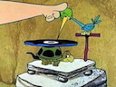

## Next

### Tags

Entries now support tag frontmatter. This introduces a new way of making
associations between entries. Tags can encoded in entries as YAML arrays or as a
string (with comma and/or space delimiters):

    ---
    title: My Entry
    tags: beautifulTag, lovelyTag
    ---

    Blah blah blah.

Then, in your ERB or Liquid templates you can get entries via tag:

    <% tags.beautifulTag.entries.each do |entry| %>
      <li><%= entry.title %></li>
    <% end %>

## v0.7.0

This release adds Atom feed support to the RSS builder. In your configuration
file, you can configure feed formats to `rss` (the default) or `atom` now:

    my_collection:
      rss:
        format: atom
        url: haha.xml

## v0.6.1

This release just fixes a mistake I made, where I built and pushed a tag from a
non-`main` branch, causing the RubyGems release to technically be for the wrong
SHA.

## v0.6.0

This release contains improvements to RSS feed generation:

- Additonal settings per RSS feed (maximum feed item count and configurable
  managing editor metadata).
- No more invalid `<managingEditor>` values. A default managing editor email is
  now prefixed to the default collection author name for [W3C validated
  feeds][w3c-feed-checker].

[w3c-feed-checker]: https://validator.w3.org/feed/check.cgi

## v0.5.1

Resolved warnings output by `gem build`.

## v0.5.0

This release refactors all of our builders to use parallelization, meaning that
`lifer build` process should be faster. It should be much faster for larger
projects. I'm using the `parallel` gem for parallelization at this time.

## v0.4.1

Resolves a bug where Liquid templates using the `` tag were not able
to render partials.

## v0.4.0

This release locks the `liquid` dependency to Liquid 5.6 or greater. Liquid 5.6
added `Liquid::Environment` for managing document context that was previously
stored in `Liquid::Template`, which was global and unsafe. This release ensures
that Lifer supports the new `Liquid::Environment` way of handling Liquid's local
filesystem for templates and partials.

## v0.3.0

This version marks the first version of Lifer that is kind of usable. The README
currently describes the big picture best. But I can add that, as of this version,
I've documented all of the public interfaces and added a good number of `FIXME`
comments to indicate functionality that _works_ but isn't quite where I want it
to be long term.

To manually test everything, I took my legacy Jekyll-based static site and
successfully ported it to Lifer.

The biggest thorn in my side is the Liquid rendering implementation. It works,
but the amount of trouble it was, and the not-very-serious way Liquid reports
rendering issues after build time, makes me think that this will come back to
haunt me.

Special thanks to [Chris][1] for helping me with some loading issues and
[Madeline][2] for helping me diagnose some disgusting Liquid template rendering
issues.

[1]: https://github.com/forkata
[2]: https://github.com/madelinecollier

## v0.2.0

